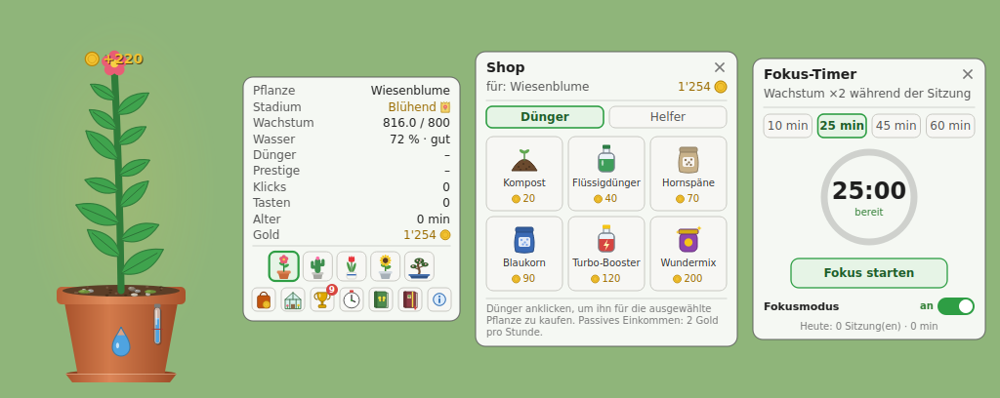
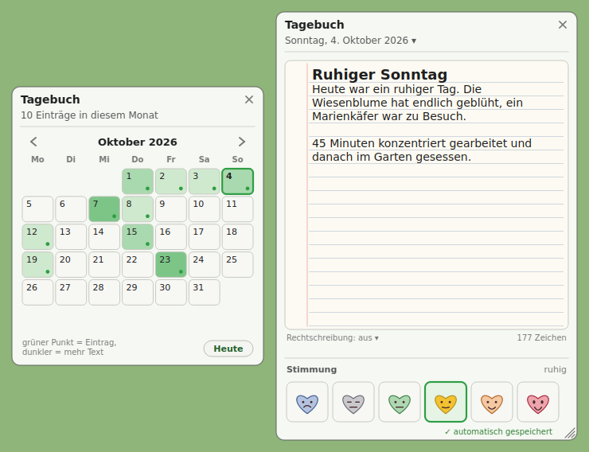
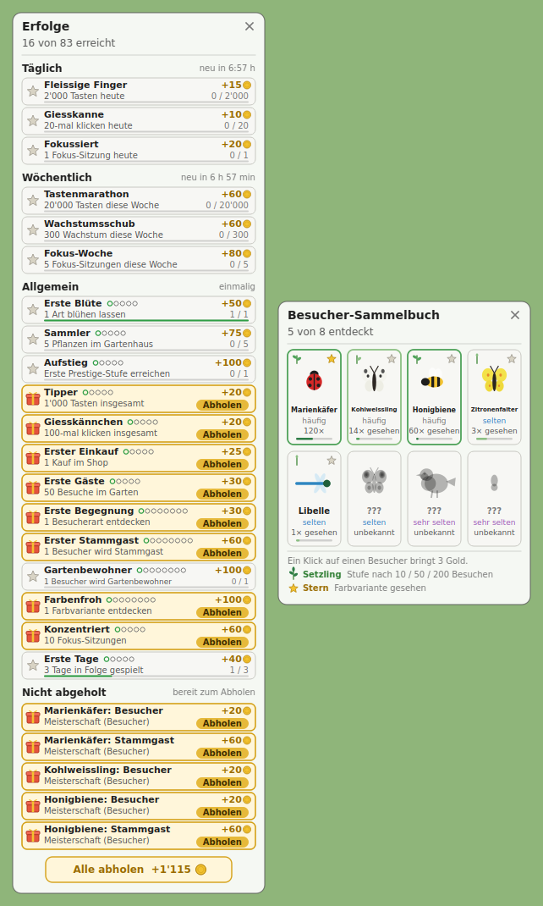

<p align="center"></p>

# Topfpflanze

**Ein Fokus-Spiel für den Desktop:** Während du am Computer arbeitest, wächst neben deinem Bildschirm eine Pflanze. Jeder Mausklick
und jeder Tastendruck lässt sie wachsen. Dazu gibt es einen Fokus-Timer, ein Tagebuch mit Kalender und Stimmungen, Besucher zum Sammeln,
Erfolge und vieles mehr. Läuft unter Windows, macOS und Linux (PyQt6).

> **Datenschutz:** Gezählt wird nur die *Anzahl* der Tastendrücke, nie welche Taste. Alles bleibt auf deinem Gerät: Spielstand, Tagebuch und
> Rechtschreibprüfung arbeiten offline.



## Das Wichtigste

- **Fünf Pflanzen** (Wiesenblume, Kaktus, Tulpe, Sonnenblume, Bonsai) mit eigenen Töpfen (über 30 Designs) und eigenem Spielstand.
- **Wachsen durch Arbeit:** Klicks giessen und lassen wachsen, Tastendrücke ebenso. Wasser, Dünger und Helfer (je Pflanze) bestimmen das Tempo.
- **Fokus-Timer** mit Fokusmodus: Beim Start verschwinden alle Menüfenster, nur Pflanze und Zeit bleiben.
- **Tagebuch** mit Kalender, sechs Stimmungs-Herzen und Rechtschreibprüfung; der Text wird von selbst gespeichert.
- **Besucher** (Käfer, Bienen, Schmetterlinge, Libelle, Rotkehlchen, Glühwürmchen) mit Stufen und seltenen Farbvarianten, **über 80 Erfolge** und **Prestige**.
- **Gartenhaus:** ausgewachsene Pflanzen werden eingelagert und stehen in der Ehrenhalle.
- **Vier Sprachen:** Deutsch, Englisch, Französisch, Italienisch. Hell- und Dunkelmodus, Grösse der Pflanze und der Menüs stufenlos einstellbar.
- **Spieldaten sichern:** exportieren, importieren, zurücksetzen.





## Herunterladen

Fertige Programme (keine Python-Installation nötig) gibt es auf der Seite [Releases](https://github.com/donsimm/topfpflanze-v1/releases).
Der Spielstand bleibt bei einem Update erhalten.

| System | Datei | Hinweis |
|---|---|---|
| Windows 10/11 | `Topfpflanze-windows.zip` | ZIP entpacken, `Topfpflanze.exe` starten. SmartScreen: «Weitere Informationen → Trotzdem ausführen» (nicht signiert). |
| macOS (Apple Silicon, M1 und neuer) | `Topfpflanze-macos-apple-silicon.zip` | App per Rechtsklick → Öffnen starten (nicht signiert). Für die Tastaturzählung unter Systemeinstellungen → Datenschutz → «Eingabeüberwachung» freigeben. |
| macOS (Intel, ältere Macs, ab macOS 12) | `Topfpflanze-macos-intel.zip` | wie oben |
| Linux | `Topfpflanze-linux.tar.gz` | `tar xzf Topfpflanze-linux.tar.gz && ./Topfpflanze/Topfpflanze`. Benötigt `libxcb-cursor0`; für Wayland Benutzer in der Gruppe `input`. |

Den Chip deines Macs zeigt Apple-Menü → «Über diesen Mac».

## Installation aus dem Quellcode

```
pip install .            # Windows / macOS / Linux
pip install ".[linux-keys]"   # Linux: zusätzlich evdev (Wayland)
topfpflanze              # oder: python -m topfpflanze
```

Debian/Ubuntu: vorher `sudo apt install python3-venv python3-pip libxcb-cursor0 libpulse0` (`libpulse0` für den Ton; ohne Audio bleibt das Spiel stumm), dann in einer virtuellen Umgebung installieren (`python3 -m venv .venv && source .venv/bin/activate`). Ohne `libxcb-cursor0` startet Qt (ab 6.5) nicht.

Linux, ohne offenes Terminal (Programmmenü-Eintrag mit dem Wiesenblumen-Symbol, optional Autostart beim Anmelden):

```
bash scripts/install-linux.sh              # nur Programmmenü
bash scripts/install-linux.sh --autostart  # zusätzlich beim Anmelden starten
```

Meldungen des Spiels landen dann in `~/.local/share/topfpflanze/topfpflanze.log`.
Aktualisieren: im Projektordner `git pull` und `pip install -e .`, dann das Spiel neu starten.

## Bedienung

Eine ausführliche Anleitung mit allen Werten steht im Spiel (Sprechblase → Info-Symbol). Kurz:

- **Linksklick** auf die Pflanze: giessen und wachsen lassen. **Ziehen:** Fenster verschieben. **Mittelklick:** Sprechblase ein/aus. **Rechtsklick:** Menü.
- **Sprechblase:** oben die fünf Pflanzen, unten Shop, Gartenhaus, Erfolge, Fokus-Timer, Besucher-Sammelbuch, Tagebuch und Info.
- **Rechtsklick → Einstellungen:** Tastaturzählung, Sprache, Dunkelmodus, Immer im Vordergrund, Pflanzen- und Menügrösse, Lautstärke (standardmässig stumm).

## Plattformhinweise

| System | Tastaturzählung | Hinweis |
|---|---|---|
| Windows | pynput | Spielstand in `%APPDATA%\topfpflanze` |
| macOS | pynput | Systemeinstellungen → Datenschutz → «Eingabeüberwachung» für die App freigeben; Spielstand in `~/Library/Application Support/topfpflanze` |
| Linux X11 | pynput oder evdev | `~/.local/share/topfpflanze` |
| Linux Wayland | evdev | Benutzer muss in der Gruppe `input` sein; Fenster bleiben je nach Compositor nicht «immer im Vordergrund» |

## Entwicklung

```
pip install -e ".[dev]"
QT_QPA_PLATFORM=offscreen pytest
QT_QPA_PLATFORM=offscreen python scripts/make-screenshots.py   # erzeugt die Bilder in docs/
```

Die Tests laufen ohne Bildschirm. Fertige Programme baut der Workflow `Release` (Git-Tag `vX.Y.Z` oder von Hand gestartet): Windows, macOS (Apple Silicon und Intel) und Linux. Der Intel-Bau nimmt Qt 6.8, damit er unter macOS 12 läuft.

## Debug-Modus und Testen

```
python -m topfpflanze --debug              # eigener Spielstand im Unterordner «debug»
python -m topfpflanze --debug --speed 60   # mit Zeitraffer
python -m topfpflanze --data-dir ~/test    # beliebiger Spielstandordner (auch ohne Debug)
```

Im Debug-Modus zeigt das Pflanzenfenster oben links «DEBUG», und das Rechtsklick-Menü hat den Eintrag **Debug**:
Zeitraffer (1x/10x/60x/600x für Wasser, Dünger, Helfer, Besucher, Fokus-Timer, passives Einkommen), Gold, Wachstum und Wasser setzen,
Besucher erscheinen lassen, Fokus-Timer (1 Minute), Tastendrücke/Klicks für Erfolge, Tages-/Wochenerfolge zurücksetzen,
alle Helfer freischalten, Prestige +1. Der echte Spielstand bleibt unberührt.

## Tagebuch

Das Tagebuch-Symbol in der Sprechblase öffnet das Textfenster des heutigen Tags (die erste Zeile ist der Titel). Der Text wird von selbst
gespeichert, dazu eine von sechs Stimmungen (Herzen). Ein Klick auf das Datum oben blendet den Kalender ein (Wärmekarte: grüner Punkt = Eintrag,
dunkler = mehr Text). Die Rechtschreibung wird offline mit Hunspell geprüft (Sprache unter dem Blatt wählbar; Rechtsklick auf ein
markiertes Wort zeigt Vorschläge). Das Textfenster bleibt im Fokusmodus sichtbar. Die Einträge liegen in `diary.json` im Datenordner.

## Spieldaten sichern

Rechtsklick → **Spieldaten**: *Exportieren* speichert Spielstand, Tagebuch und eigene Wörter in einer ZIP-Datei (das Tagebuch zusätzlich als
lesbare Textdatei `tagebuch.txt`), *Importieren* ersetzt den jetzigen Stand durch eine Sicherung (vorher wird der jetzige Stand in `backups/`
gesichert, danach startet das Spiel neu), *Datenordner öffnen* und *Programmordner öffnen* zeigen die Ordner, *Alle Spieldaten zurücksetzen*
beginnt von vorn (ebenfalls mit Sicherung vorher).

## Grösse der Oberfläche

Rechtsklick → Einstellungen → zwei getrennte Regler (50 bis 200 %, «100 %» setzt zurück):

- **Pflanzengrösse:** Pflanze mit Topf (die Spielgrafik).
- **Menügrösse:** Sprechblase, Shop, Gartenhaus, Erfolge, Fokus-Timer, Sammelbuch. Standard 100 % (frühere Grösse).

Beide Einstellungen werden gespeichert. Über 100 % wird ein Fenster nie grösser als der Bildschirm.

## Sprachen

Deutsch (Standard), Englisch, Französisch und Italienisch. Umschalten: Rechtsklick → Einstellungen → Sprache / Language (das Spiel startet dabei neu).
Ohne Auswahl gilt die Systemsprache, sonst Deutsch.

Der deutsche Text ist der Schlüssel: im Code steht `tr("Dünger")`, mit Werten `tr("noch {n} bis {name}", n=3, name=x)`
(`i18n.py`). Die Übersetzungen stehen je Sprache in `src/topfpflanze/lang/<code>.py` (Wörterbuch `STRINGS`). Fehlt ein
Eintrag, erscheint der deutsche Text.

Neue Sprache: `lang/en.py` nach `lang/<code>.py` kopieren, die Werte übersetzen (Platzhalter `{…}` unverändert lassen),
den Code in `i18n.LANGUAGES` und in `i18n._load` eintragen und in `tests/test_basics.py` bei den Sprach-Tests ergänzen. Ein Test (`test_language_catalog_is_complete_and_consistent`)
prüft, dass kein Text fehlt und die Platzhalter stimmen. Neuer Text im Code: immer mit `tr(…)` schreiben und den
englischen Eintrag ergänzen, sonst schlägt der Test fehl.

## Aufbau (`src/topfpflanze/`)

| Modul | Inhalt |
|---|---|
| `app.py` | Programmstart, Kommandozeile, Spielanleitung im Kopf |
| `config.py` | Pfade, Fenstergrössen, Gold-Konstanten |
| `data.py` | Pflanzenarten, Dünger, Helfer, Besucher, Erfolge, Topfgeometrie |
| `plant.py` | Pflanzenfenster: Spielzustand, Logik, Eingaben, Menü |
| `plant_draw.py` | Zeichnen von Topf, Erde, Partikeln, Pflanzen |
| `bubble.py`, `shop.py`, `garden.py`, `panels.py`, `info.py` | Sprechblase, Shop, Gartenhaus, Erfolge/Fokus/Sammelbuch, Info-Fenster (Werte aus `data.py`, Release Notes aus `changelog.py`) |
| `drawing.py`, `theme.py`, `util.py` | Symbole, Farbschemata, Hilfsfunktionen |
| `keys.py` | Tastaturzählung (nur Anzahl) |
| `diary.py` | Tagebuch: Kalender (Wärmekarte), Textfenster mit Stimmungs-Herzen, `diary.json` im Datenordner |
| `icons/` | Programmsymbol (Wiesenblume): PNG, ICO (Windows), ICNS (macOS) |
| `backup.py` | Spieldaten exportieren und importieren (ZIP mit Spielstand, Tagebuch, eigenen Wörtern) und das Rückfragefenster |
| `spell.py`, `dictionaries/` | Rechtschreibprüfung im Tagebuch (Hunspell über spylls, Wörterbücher de_CH, en_US, fr_FR, it_IT; Lizenzen in `dictionaries/NOTICE.md`) |
| `i18n.py`, `lang/` | Mehrsprachigkeit: `tr()`, Sprachwahl, Übersetzungen |
| `sound.py` | Ton: Giesssound und Gong (selbst erzeugt), Lautstärke |
| `sow.py`, `pots.py` | Dialog «Einlagern & neu aussäen», zufällige Topf-Varianten (Skins) |
| `scaling.py` | Skalierung der Oberfläche (Basisklasse `ScaledWidget`) |
| `helper_art.py` | Grafiken der Helfer (Anzeigen, Zwerg, Lampe) |
| `debug.py` | Debug-Modus |

Neue Pflanze: Eintrag in `data.py` (`PLANT_TYPES`, `PLANT_ORDER`, ggf. `POTS`) und eine `draw_<key>`-Methode in `plant_draw.py`.

## Stand der Tests

| System | Stand |
|---|---|
| Linux (Ubuntu, X11) | läuft, im Alltag getestet |
| Windows 10 und 11 | getestet (Version 0.1.0) |
| macOS Intel, macOS 12.7 (Monterey) | läuft (Bau mit Qt 6.8, das macOS 12 unterstützt; Qt 6.10 und neuer braucht macOS 13) |
| macOS Apple Silicon | noch nicht getestet; die frühere Version stürzte wegen falsch gepackter App ab, die Packung ist korrigiert |

Die Builds sind nicht signiert: Windows SmartScreen und macOS Gatekeeper fragen beim ersten Start nach.

## Offene Punkte / Roadmap

- **Grafik:** Die Bilder sind vorläufig KI-generiert und sollen durch richtige Zeichnungen ersetzt werden (Zeichner und Illustratoren gesucht).
- **Sound:** Die Klänge sind selbst erzeugt und sollen in der finalen Version von Menschen gemacht sein.
- **macOS Apple Silicon** testen; Windows und macOS mit der aktuellen Version nochmals prüfen.
- **Autostart** für Windows und macOS (unter Linux gibt es das Skript `scripts/install-linux.sh --autostart`), **Tray-Symbol**, **Signierung/Notarisierung** der Builds.
- **Sprachen:** Die englischen, französischen und italienischen Texte sind nicht von Muttersprachlern geprüft; weitere Sprachen sind möglich (siehe «Sprachen»).
- **Tagebuch:** Stimmung im Kalender anzeigen; Import kann Tagebücher mehrerer Geräte nicht zusammenführen (er ersetzt alles); der Discord-Link im Reiter «Version» ist nicht anklickbar.
- **Lizenz:** Für den Programmcode ist noch keine Lizenz festgelegt (die Wörterbücher unter `src/topfpflanze/dictionaries/` haben eigene Lizenzen, siehe `NOTICE.md`).

## Über das Projekt

Das Projekt ist **Vibecoding**: Der Quellcode ist zu 100 % KI-generiert, gesteuert nur über die Eingaben (Prompts) an ein Sprachmodell.
Auch die Grafik ist vorläufig KI-generiert, weil ich leider nicht zeichnen kann, und wird so schnell wie möglich durch richtige Zeichnungen ersetzt.
**Zeichner und Illustratoren werden gesucht!** In der finalen Version soll auch der Sound von Menschen gemacht sein.

Fragen oder Anregungen: [Discord](https://discord.gg/Gkmkum2G8G)
